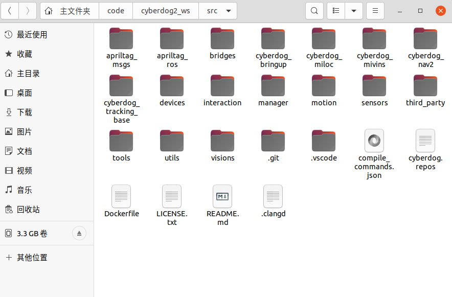
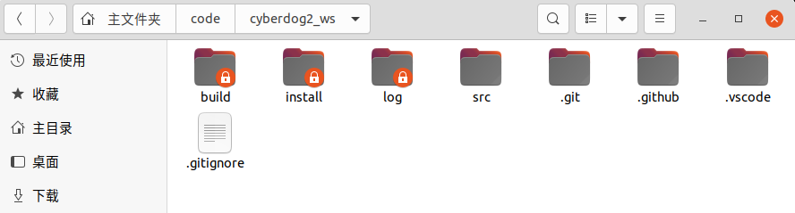

# mivins包部署

## 说明

`cyberdog_img:1.0` 镜像是 **arm64 原生环境**（在 x86 电脑上通过 QEMU 模拟运行），编译产物可直接部署到机器狗 NX 板。

实机 ROS 安装路径：`/opt/ros2/cyberdog`。


## 机器人端配置修改

### **修改自启动配置**

进入cyberdog的NX板，修改文件/opt/ros2/cyberdog/share/algorithm_manager/config/Task.toml中的DepsLifecycleNodes为以下内容

```
[[task]]
TaskName = "VisionLocalization"
Id = 7
OutDoor = true
DepsNav2LifecycleNodes = []
DepsLifecycleNodes = ["camera/camera", "stereo_camera", "mivinslocalization"]
```

vins必须依赖camera/camera这个生命周期节点

## 编译

在小米docker（cyberdog_img:1.0）中，编译mivins功能包

### 1. 编译mivins_core

进入mivins_core文件夹下

```bash
mkdir build
cd build
cmake .. -DAPP_TYPE=ros2
make
make install
```

### 2. 编译mivins_ros

进入源码工作空间

源码内包括以下内容



在工作空间下进行编译，编译产物进入install文件夹中



```bash
colcon build --packages-up-to vins --merge-install
```


## 实机部署

使用[deploy_mivins.sh](../env/deploy_mivins.sh)将编译产物拷贝到机器狗NX板中


```bash
# 在宿主机执行
cd ~/code/cyberdog2_pc_ws/src/env
bash deploy_apriltag.sh
```

## 使用

### 脚本启动方式

使用[start_vio.sh](../env/start_vio.sh)启动多台机器人的realsense相机驱动，以及激活VIO节点

### 手动启动方式

realsense相机驱动必须启动，这个有开机自启动节点，设置生命周期时需要加namespace

```bash
ros2 lifecycle set /{namespace}/camera/camera configure
ros2 lifecycle set /{namespace}/camera/camera activate
# 直接将以下service打开，后续apriltag_ros需要使用
ros2 service call /{namespace}/camera/realsense_frame_service std_srvs/srv/SetBool "{data: true}" 
ros2 lifecycle set /{namespace}/vinslocalization configure
ros2 lifecycle set /{namespace}/vinslocalization activate
```


## 备注

mivins长期运行，节点容易崩溃，在使用时需要关注odom_slam是否有数据，如果没有数据了，重新启动mivins节点即可

```bash
ros2 lifecycle set /cyberdog_1/vinslocalization deactivate
ros2 lifecycle set /cyberdog_1/vinslocalization cleanup
ros2 lifecycle set /cyberdog_1/vinslocalization configure
ros2 lifecycle set /cyberdog_1/vinslocalization activate
```

如果提示Node not found，关机重启即可


