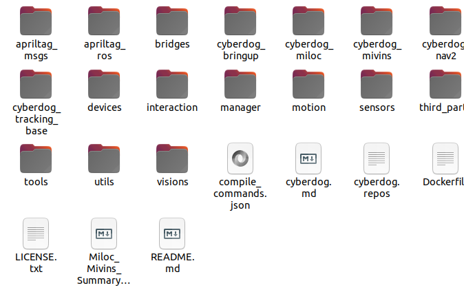
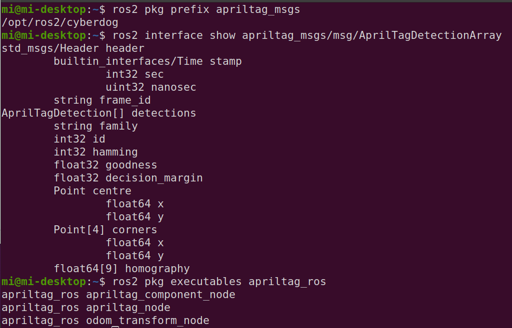

# apriltag_ros 部署方法


apriltag_ros为通过机器狗相机识别tag码的位姿，功能包输出**camera_infra1_optical_frame -> tag_0_observation**的位姿关系，以tag码（编号0）所在位置作为全局坐标系，通过odom_transform_node节点将视觉惯性里程计输出/odom_slam进行转换输出里程计在全局坐标系下的位姿话题/odom_global。


## 说明

`cyberdog_img:1.0` 镜像是 **arm64 原生环境**（在 x86 电脑上通过 QEMU 模拟运行），编译产物可直接部署到机器狗 NX 板。

实机 ROS 安装路径：`/opt/ros2/cyberdog`。

## 启动 Docker

```bash
docker run --privileged=true -it \
  -v /home/lee/code/cyberdog2_ws:/home/builder/cyberdog2_ws \
  cyberdog_img:1.0 bash
```

## 容器内：准备依赖

```bash
source /opt/ros2/galactic/setup.bash
cd /home/builder/cyberdog2_ws

# apriltag C 库（colcon cmake 包）
if [ ! -f src/third_party/apriltag/package.xml ]; then
  git clone --depth 1 --branch v3.4.5 \
    https://github.com/AprilRobotics/apriltag.git src/third_party/apriltag
fi
```

## 容器内：编译

将文件夹apriltag_msgs和apriltag_ros放置在机器狗源码工作空间下



```bash
source /opt/ros2/galactic/setup.bash    # 一定要source 
cd /home/builder/cyberdog2_ws
colcon build --merge-install --packages-select apriltag apriltag_msgs apriltag_ros
```

## 部署到实机

### 一键部署脚本

工作区路径按实际修改；机器狗 IP 默认 `192.168.44.1`。  
需安装 `sshpass`：`sudo apt install sshpass`

```bash
# 在宿主机执行
cd ~/code/cyberdog2_pc_ws/src/env
bash deploy_apriltag.sh
```

脚本路径：`src/env/deploy_apriltag.sh`

### 验证部署

远程连接机器人NX板，使用如下指令

```bash
ros2 pkg prefix apriltag_msgs
ros2 interface show apriltag_msgs/msg/AprilTagDetectionArray
ros2 pkg executables apriltag_ros
```

出现以下内容即为部署成功



---

## 实机使用

红外相机需先启动：

```bash
# 命名空间按照实际情况修改，一定要call 这个service
ros2 lifecycle set /cyberdog_1/camera/camera configure
ros2 lifecycle set /cyberdog_1/camera/camera activate
ros2 service call /cyberdog_1/camera/realsense_frame_service std_srvs/srv/SetBool "{data: true}"  
```

验证相机是否有数据：

```bash
ros2 topic echo /cyberdog_2/camera/infra1/image_rect_raw 
```

### 节点启动

**TODO: (后续写入开机自启动或脚本启动)**

在机器人NX板上启动 **apriltag** 节点 和 **位姿转换** 节点：

```bash
ros2 launch apriltag_ros apriltag_36h11.launch.py
```

```bash
ros2 run apriltag_ros odom_transform_node
```

查看检测结果：

```bash
# 命名空间自定
ros2 topic echo /cyberdog_1/apriltag/detections
```

---

## 可视化查看

本机galactic docker中启动

```bash
ros2 launch topic_visualization tags_visualize.launch.py 
```
 **TODO：当前转换后的里程计话题/odom_global的显示刷新率较低，仅供验证位置在全局坐标系下是否正确**